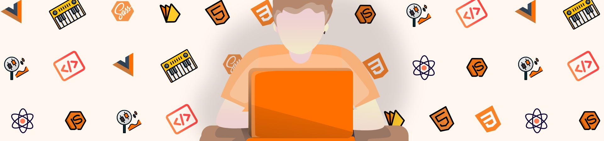

## Hi, I'm Guillaume 🙋‍♂️

<h3>In short</h3>

-   💪 [Frontend Mentor](https://www.frontendmentor.io/profile/dtczelo) is my front-end head coach.
-   👨‍💻 [Codewars](https://www.codewars.com/users/dtczelo) takes care of the algorythmic side.
-   🎹 I make underground and loud music, [like so](https://www.youtube.com/user/DtCsound6temOfficiel)
    however we can make sweet and groovy music too with my Electron/Vue/Tone sequencer... [want to try ?](https://github.com/dtczelo/Drum-Sequencer-built-with-Tone.js-Vue.js-and-Vuex)
-   📈 I learn statistics and human psychology through financial markets.

<h3>Connect with me</h3>

Are you looking for a motivated junior front-end developer ? [here is my resume](https://drive.google.com/file/d/1YLwagMQ20kgapUEoT1cMCemFjuEaMCfQ/view?usp=sharing).

For more exhaustive information 

<h3>Tools</h3>

  
  
   
  
 
   
 

  

 
  
 
 

 

 
  
 
 

